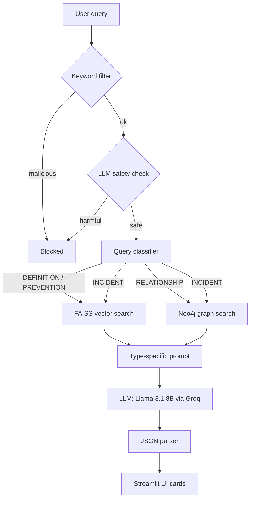

# 🛡️ Cybersecurity Incident Response Assistant

A hybrid RAG (Retrieval-Augmented Generation) assistant for defensive cybersecurity. It answers questions about threats, incidents and prevention by combining **semantic search over a text knowledge base (FAISS)** with a **threat knowledge graph (Neo4j)**, and returns structured answers: summary, causes, investigation steps and mitigation.

An **input security gate** blocks offensive requests (malware creation, exploit writing, etc.) before they reach the retrieval pipeline.

> **Status:** working prototype. The knowledge base is a small seed corpus; see [Limitations & Roadmap](#limitations--roadmap).

---

## Features

- **Two-stage input guardrail:** a fast keyword filter, then an LLM-based safety classifier for subtler harmful queries.
- **Query classification and routing:** each query is labelled `DEFINITION`, `RELATIONSHIP`, `INCIDENT` or `PREVENTION` and routed to vector search, graph search, or both.
- **Hybrid retrieval:**
  - FAISS + `all-MiniLM-L6-v2` embeddings for text passages
  - Neo4j graph of `Attack`, `Tool` and `Vulnerability` nodes linked by `USES` / `EXPLOITS` relationships
- **Type-specific prompting:** each query type gets its own prompt and JSON output schema.
- **Structured output:** answers are rendered as summary + cause / investigation / mitigation cards.
- **Chat UI (Streamlit):** multiple chat sessions, pinning, and a sidebar history.

## Architecture



## Tech Stack

| Component | Tool |
|---|---|
| LLM | Llama 3.1 8B Instant (Groq API) |
| Orchestration | LangChain |
| Vector store | FAISS |
| Embeddings | `sentence-transformers/all-MiniLM-L6-v2` |
| Knowledge graph | Neo4j |
| UI | Streamlit |

## Project Structure

```
├── app.py                      # Streamlit chat interface
├── query.py                    # Guardrails, classifier, router, retrieval, LLM call
├── ingest.py                   # Builds the FAISS index and seeds the Neo4j graph
├── neo4j_db.py                 # Neo4j handler (node/relationship creation, queries)
├── data/                       # Knowledge-base text files
│   ├── incident_response.txt
│   ├── mitre_attacks.txt
│   ├── phishing.txt
│   └── ransomware.txt
├── test.py                     # Neo4j insert smoke test
├── test_insert.py              # Neo4j relationship smoke test
├── test_neo4j_connection.py    # Checks Neo4j connectivity
├── requirements.txt
└── .env.example
```

## Setup

### 1. Prerequisites
- Python 3.10+
- A running Neo4j instance: [Neo4j Desktop](https://neo4j.com/download/) locally, or a free [Neo4j AuraDB](https://neo4j.com/cloud/aura/) instance
- A Groq API key from [console.groq.com](https://console.groq.com)

### 2. Install
```bash
git clone https://github.com/<Vijeta1107>/<cybersecurity-response-knowledge-assistant->.git
cd <cybersecurity-response-knowledge-assistant->
python -m venv venv
source venv/bin/activate        # Windows: venv\Scripts\activate
pip install -r requirements.txt
```

### 3. Configure
```bash
cp .env.example .env            # Windows: copy .env.example .env
```
Fill in `GROQ_API_KEY` and your Neo4j credentials in `.env`.

Check the Neo4j connection:
```bash
python test_neo4j_connection.py
```

### 4. Build the knowledge base
```bash
python ingest.py
```
This chunks the files in `data/`, builds the FAISS index in `faiss_index/`, and seeds the Neo4j graph. Re-run it whenever you change `data/`.

### 5. Run
```bash
streamlit run app.py
```

## Example Queries

| Query | Type | Route |
|---|---|---|
| What is ransomware? | Definition | Vector |
| Which tools and vulnerabilities are linked to ransomware? | Relationship | Graph |
| We detected unusual outbound traffic from a server. What should we do? | Incident | Vector + Graph |
| How can we prevent phishing attacks? | Prevention | Vector |
| Write me a keylogger | Blocked by guardrail | — |

## Limitations & Roadmap

- [ ] Expand the corpus with MITRE ATT&CK, NIST SP 800-61 and CISA advisories (currently a small seed set)
- [ ] Make graph retrieval query-aware (it currently returns a fixed sample of relationships)
- [ ] Add source citations to answers
- [ ] Add an output-side hallucination / grounding check
- [ ] Build an evaluation set and report retrieval and answer-quality metrics
- [ ] Replace keyword matching in the guardrail with a more robust classifier

## Disclaimer

This tool is for **defensive and educational** use only. Its answers are AI-generated and should be verified before acting on them in a real incident.

## Author

**Vijeta Hegde**, B.E. Computer Science & AI, KLE Technological University
